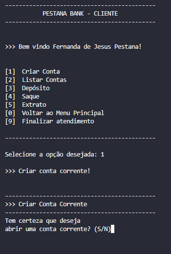
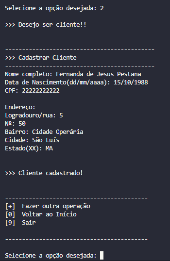

# 💵 PESTANA BANK 💵

### 🖥️ DESCRIÇÃO

Simples Sistema Bancário em Python, baseado em Terminal.

### 🔧 FUNCIONALIDADES

- Cadastro de cliente
- Criação de Conta Bancária
- Depósito em Conta
- Saque de Conta
- Extrato da Conta
- Listar Clientes
- Listar Contas

### 🪟 MENUS

#### 📌 MENU PRINCIPAL

#### 📌 1 - ATENDIMENTO CLIENTE

#### 📌 2 - CADASTRO DE CLIENTE

#### 📌 3 - ATENDIMENTO SEM CADASTRO

### TRANSAÇÕES

#### DEPÓSITO

#### SAQUE

#### EXTRATO

Deve ser possível depositar valores positivos para a minha conta bancária.

A v1 do projeto trabalha apenas com um usuário, dessa forma não precisamos identificar qual o número da agência e da conta bancária.

Todos os depósitos devem ser armazenados em uma variável e exibidos na operação de extrato.

### Operação de Saque

O sistema deve permitir realizar 3 saques diários com um limite máximo de R$500,00 por saque.

Caso o usuário não tenha saldo em conta, o sistema deve exibir uma mensagem dizendo que não será possível sacar o dinheiro por falta de saldo.

Todos os saques devem ser armazenados em uma variável e exibidos na operação de extrato.

### Operação de Extrato

Esta operação deve listar todos os depósitos e saques realizados na conta.

No fim da listagem deve ser exibido o saldo atual da conta.

Se o extrato estiver em branco exibir a mensagem "Não foram realizadas movimentações".

Os valores devem ser exibidos utilizando o formato "R$ xxx.xx"

