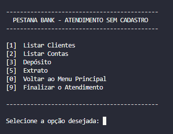

# 💵 PESTANA BANK 💵


### 🖥️ DESCRIÇÃO
<br>
Simples Sistema Bancário em Python, baseado em Terminal.
<br><br>
Versão : 2.0.0
<br><br>

### 🛠️ FERRAMENTAS
<br>
Neste projeto foram utilizadas as seguintes ferramentas:
<br><br>

| Python |   Git    |   GitHub    |
|:--------:|:--------:|:--------:|
|  |  | 

<br><br>
### ✅ PRÉ-REQUISITOS
<br>
Para rodar o aplicativo, é necessário possuir instaladas em sua máquinas as seguintes ferramentas:
<br><br>

| Python |   Git    |
|:--------:|:--------:|
|  | 

<br>

### 🚀 RODANDO APLICATIVO
<br>
Abra um terminal na pasta onde deseja salvar o aplicativo.

Clone este repositório:

```
git clone git@github.com:pestanafj/dio-sistema-bancario.git
```

Acesse a pasta do repositório:
```
cd dio-sistema-bancario
```
Execute o arquivo sistema-bancario.py utilizando o Python.
```
python sistema-bancario.py
```
<br><br>
### 🔧 FUNCIONALIDADES
<br>

- [x] Cadastro de cliente
- [x] Criação de Conta Bancária
- [x] Depósito em Conta
- [x] Saque de Conta
- [x] Extrato da Conta
- [x] Listar Clientes
- [x] Listar Contas
- [ ] Senha de Cliente
- [ ] Senha Administrador
<br><br>

### 🪟 MENUS
<br>

#### 📌 MENU PRINCIPAL
<br>

<br><br>

#### 📌 MENUS SECUNDÁRIOS
<br>

| [1] - CLIENTE |   [3] - SEM CADASTRO    |
|:--------:|:--------:|
|  | 

<br><br>


### 💸 CADASTRO E CRIAÇÃO DE CONTA
<br>

#### 📌 1 - CADASTRO DE CLIENTE

O cadastro de um novo cliente é acessado a partir do menu principal, opção [2] - Desejo ser Cliente.


<br>
Devem ser informados os seguintes dados:
- Nome
- Data de Nascimento
- CPF
- Endereço (composto por Logradouro, Nº da casa, Bairro, Cidade e Estado)

OBS: Só é permitido um cadastro por CPF.
<br><br>
#### 📌 2 - CRIAÇÃO DE CONTA
<br>
A criação de uma nova conta é acessada pelo Menu "ATENDIMENTO CLIENTE", opção [1] - Criar Conta.

Um cliente pode ter várias contas.

Os dados da conta são gerados automaticamente pelo sistema quando solicitada a criação da conta.


<br>
Em cada conta são guardadas as seguintes informações:
- Agência: 0001 (fixa)
- Numéro da Conta: Gerado pelo sistema
- CPF do dono
- Limite de saque
- Quantidade de saques disponíveis
- Quantidade de saques realizados
- Saldo
- Extrato

<br><br>

### 💸 TRANSAÇÕES

#### 💰 DEPÓSITO

O depósito pode ser feito por um cliente cadastrado ou por um indivíduo sem cadastro.

| Depósito Cliente | Depósito Sem Cadastro |
|:--------:|:--------:|
|  |  |


Para um cliente cadastrado, serão listadas as contas daquele cliente, e ele fará a seleção da conta em que deseja fazer o depósito.

Para um indivíduo sem cadastro, ele deve informar o número da conta em que ele deseja fazer o depósito.

É possível depositar valores positivos em qualquer conta bancária.

O valor do depósito deve estar no formato "xx,xx" ou "xx.xx", qualquer outro formato não será aceito.

Todos os depósitos são armazenados em uma variável e exibidos na operação de extrato.
<br><br>
#### 🪙 SAQUE 

O saque só pode ser feito por um cliente cadastrado.


<br><br>
Serão listadas as contas daquele cliente, e ele fará a seleção da conta em que deseja fazer o saque.

O valor do saque deve estar no formato "xx,xx" ou "xx.xx", qualquer outro formato não será aceito.

O sistema permite realizar 3 saques diários com um limite máximo de R$500,00 por saque.

Caso o usuário não tenha saldo em conta, o sistema exibe uma mensagem dizendo que não será possível sacar o dinheiro por falta de saldo.

Todos os saques são armazenados em uma variável e exibidos na operação de extrato.
<br><br>
#### 🧾 EXTRATO

O extrato pode ser solicitado por um cliente cadastrado ou por um indivíduo sem cadastro.
<br><br>
| Extrato Cliente | Extrato Sem Cadastro |
|:--------:|:--------:|
|  |  |

<br>
Para um cliente cadastrado, serão listadas as contas daquele cliente, e ele fará a seleção da conta que deseja tirar o extrato.

Para um indivíduo sem cadastro, deve ser informado o número da conta da que ele deseja solicitar o extrato.

Esta operação lista todos os depósitos e saques realizados na conta.

No fim da listagem será exibido o saldo atual da conta.

Se o extrato estiver em branco é exibida a mensagem "Não foram realizadas movimentações".

Os valores serão  exibidos utilizando o formato "R$ xx.xx"
<br><br>

### ⚙️ FUNÇÕES ADMINISTRATIVAS
<br>

#### 📌 LISTAR CLIENTES
<br>
A listagem de clientes é acessada através do Menu [3] - ATENDIMENTO SEM CADASTRO, opção [1] - Listar Clientes.


<br><br>

#### 📌 LISTAR CONTAS
<br>
A listagem de contas é acessada através do Menu [3] - ATENDIMENTO SEM CADASTRO, opção [2] - Listar Contas.


<br><br>

### 👩🏻‍💻 AUTOR
<br>
Fernanda Pestana [pestanafj]

Projeto criado durante Bootcamp DIO - Potencia Tech powered by Ifood - Ciência de Dados em Python.

Julho 2023.
